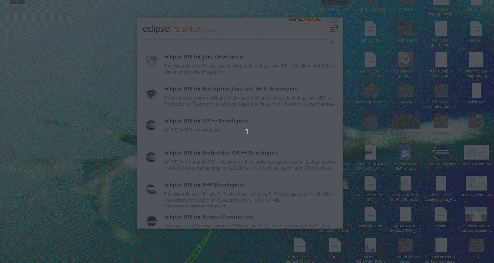
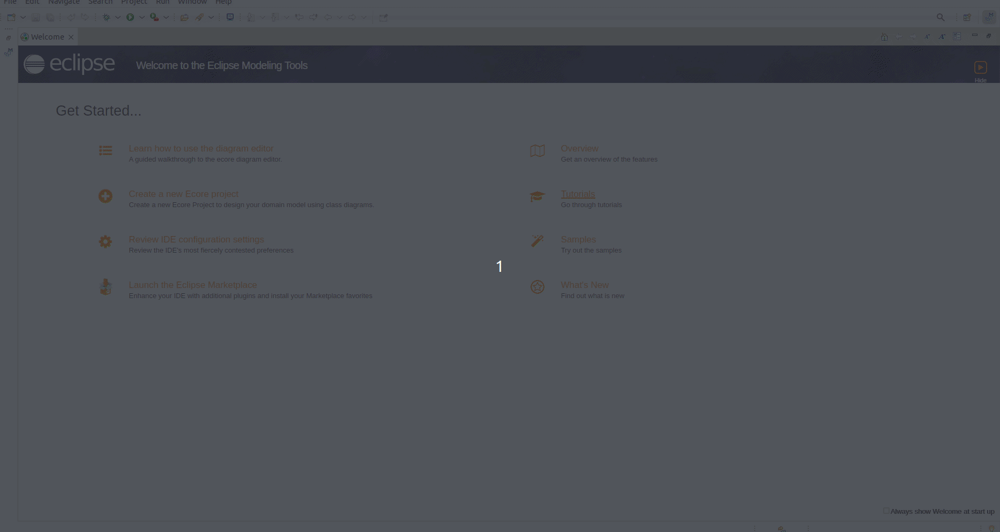
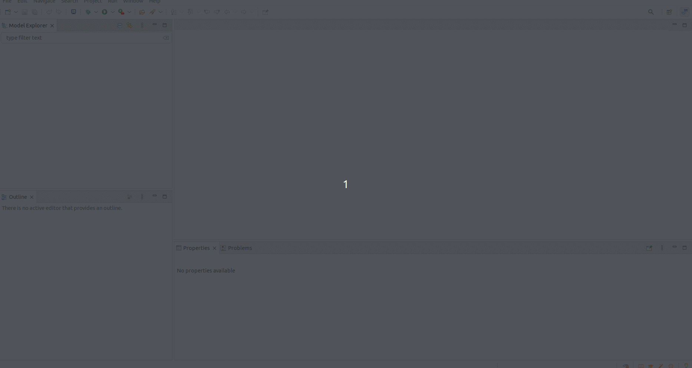
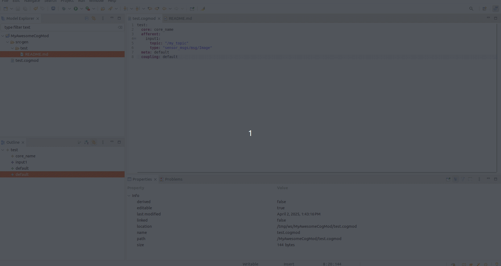

## CognitiveModule_ModelImplementation_Pilot
This repository holds the metamodel and the DSL implementation for the formal represnetation of Cognitive Modules for the CORESENSE project.


### Installation

First, the Java environment has to be set. For Linux it can be installed with the following command:

```
sudo apt-get install openjdk-XY-jre
```

The current status of this repository has been sucesfully tested with the XY version 21. However, it is expected to work also with tha letest version.

Then Eclipse can be installed. Please download the installer from the official Eclipse [website](https://www.eclipse.org/downloads/packages/installer). After unpacking the downloaded file, the installer can be run by calling the command *./eclipse-inst* from the console. 

Once you start the installer, select the package "Eclipse Modeling Tools". You can find it just by scrolling or using the searching tool:

Press next, and then pick the Java version and the folder where you would like to install Eclipse.



Continue the installation, accepting the license, as usual.

#### From Release (recommended)

Once the installation is completed, go to *Help* > *Install New Software...*. To install the latest version of the ROS tooling, add the update site URL [https://raw.githubusercontent.com/CoreSenseEU/Tooling-update-site/main](https://raw.githubusercontent.com/CoreSenseEU/Tooling-update-site/main). in the *Work with* section.

Update site address: 



If no package is listed, please uncheck the option *Group items by category*. The category *ROS Model* appears in the *Name* area. Check the box in front of *CoreSense Cognitive Module Feature* and click *Next* to review the list of items to be installed. Click *Next* again to read and accept the terms of the license agreements and afterwards click *Finish*. Eclipse will then start to install the ROS tooling and its dependencies. If you get a security warning about the authenticity, click OK. Finally, when asked, restart Eclipse to complete the installation process.

#### From Source (only for tooling developers)

Clone the repository directly on your workspace:

```
git clone git@github.com:CoreSenseEU/CognitiveModule_ModelImplementation_Pilot.git
```

Then use the menu File->Import->Existing Projects Into Workspace and select the folder of the cloned repository as root folder.


This installation requires the Xtext framework, this can be installed using the Eclipse Marketplace, it can be open within the menu "Help"->"Eclipse MarketPlace" 


### Create new projects and models

To start developing your model you can create a new Project. We recommend the creation of an empty one. Then you can create a file with the extension ".cogmod" within the project, by default Eclipse will ask you to set the Project as a Xtext one, and open the Cognitive Module models editor which contains autocomplete funcion (by pressing Ctrl+Espace bar) and validation of the model.



The current model implementation has the following grammar:

```
my_awesome_cognitive_module: #Name of the module
  **core:** CoreName
  **efferent:** # Optional
    EfferentName:
      **topic:** TopicName
      **type:** TopicType
  **afferent:** # Optional
    AfferentName:
      **topic:** TopicName
      **type:** TopicType
  **meta:** MetaName
  **Coupling:** CouplingName
```
The attributes name of the module, core, meta and coupling are mandatory, if the are now set the model will provide an error.



While saving (Ctrl+S) a valid model, a new src-gen folder will be automatically generated. For this first release version it contains only a README.md file.

### Development guide

tbd....
